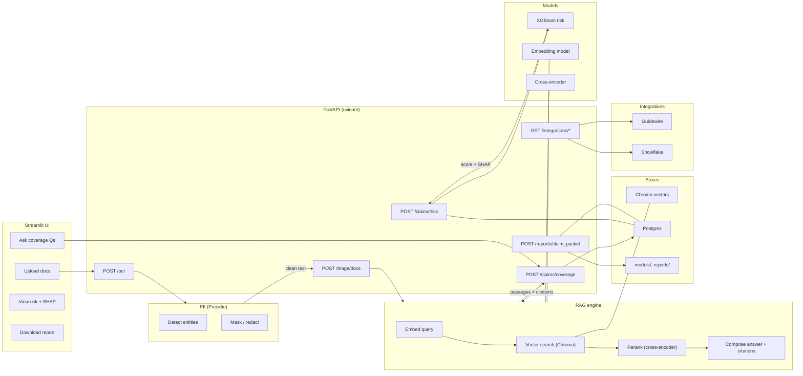
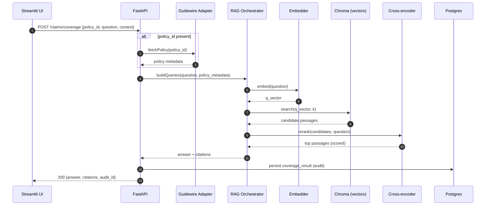
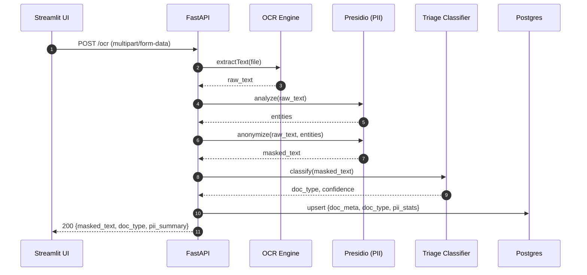
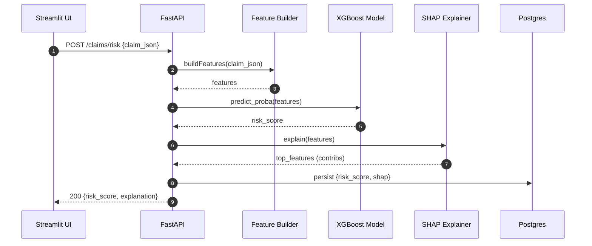
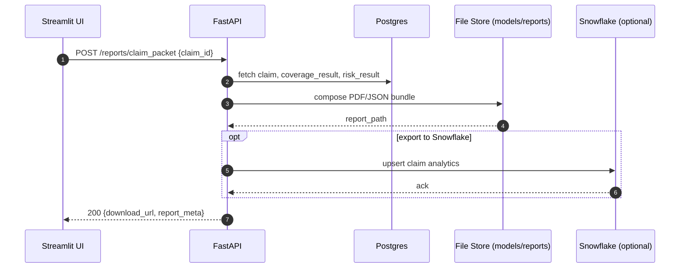
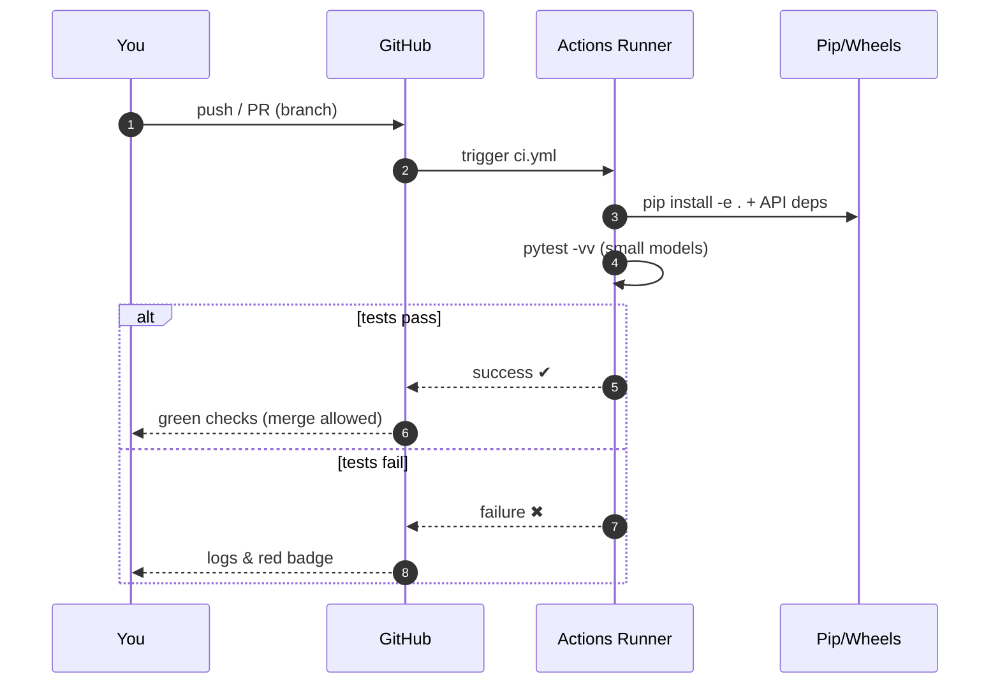

# ClaimSight AI — Open-Source Claims Intelligence Platform

**ClaimSight AI** is an end-to-end claims intelligence platform for insurance:
- **RAG-powered policy reasoning** with citations (vector search + **cross-encoder reranker**)
- **Fraud/risk scoring** (XGBoost) with **SHAP** explanations
- **Document triage** with **Presidio PII masking**
- **Streamlit UI** + **FastAPI** + **Docker Compose**
- **Snowflake connector** for enterprise data integration

> Privacy-first: synthetic sample data included; PII masking is built-in.

## Developer Experience (Makefile)

- **make up       # build, seed data, start stack
- **make test     # run pytest inside API container
- **make train    # train toy XGBoost model via admin API
- **make logs     # tail logs
- **make down     # stop stack

## Architecture

## Coverage Q&A (RAG with citations)

## OCR → PII Masking → Triage

## Coverage Q&A (RAG with citations)

## Risk scoring with SHAP

## Report generation (auditable packet)

## CI Badge

###  Core System Integrations (stubs)

| Endpoint                                                | Description                                 |
|---------------------------------------------------------|---------------------------------------------|
| `/adapters/guidewire/policy/{policy_id}`                | Guidewire **PolicyCenter** policy summary   |
| `/adapters/guidewire/claim/{claim_id}`                  | Guidewire **ClaimCenter** claim details     |
| `/adapters/guidewire/fnol` (POST)                       | Create FNOL payload stub                    |
| `/adapters/duckcreek/policy/{policy_id}`                | Duck Creek PAS policy summary               |
| `/adapters/duckcreek/policy/{policy_id}/endorsements`   | Duck Creek endorsements list                |

> These are safe **stubs** for demos/unit tests. Replace base URLs/auth to connect to real environments via REST/SOAP.

**Coverage logic (demo):**  
The `/claims/coverage` endpoint blends **RAG** (policy text with citations) and **core systems data** (Duck Creek / Guidewire endorsements).  
- If `loss_type=water` and **WTR-BKP** (or equivalent) is present, result is **yes (endorsement)**.  
- Otherwise, water backup is **excluded** per policy text.  
- Fire / theft follow “perils insured against” language.  
- All responses include **citations** and, when applicable, **endorsement codes**.

